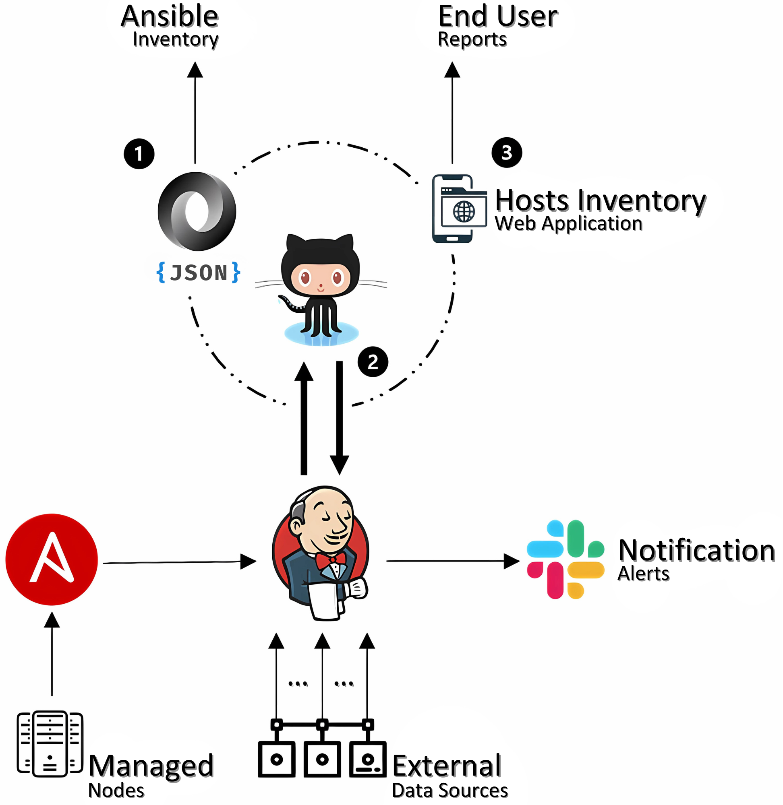
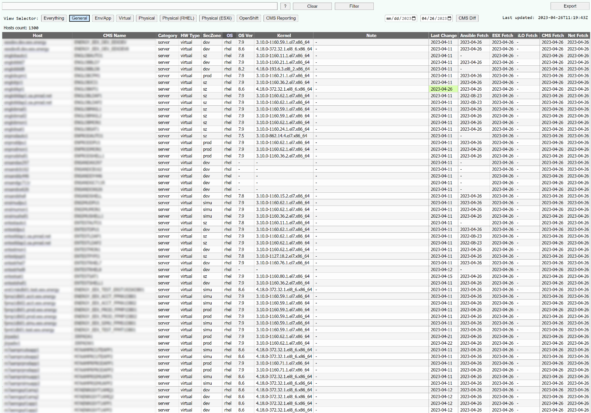
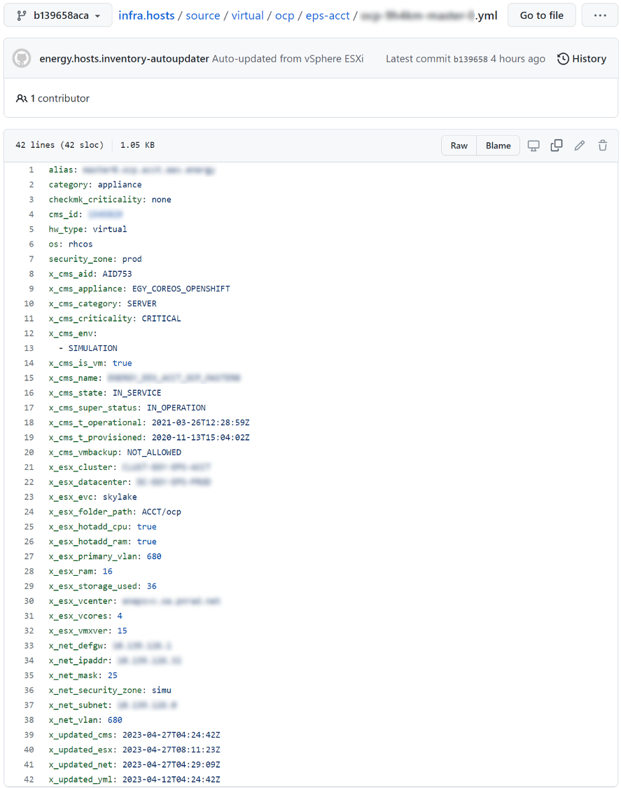
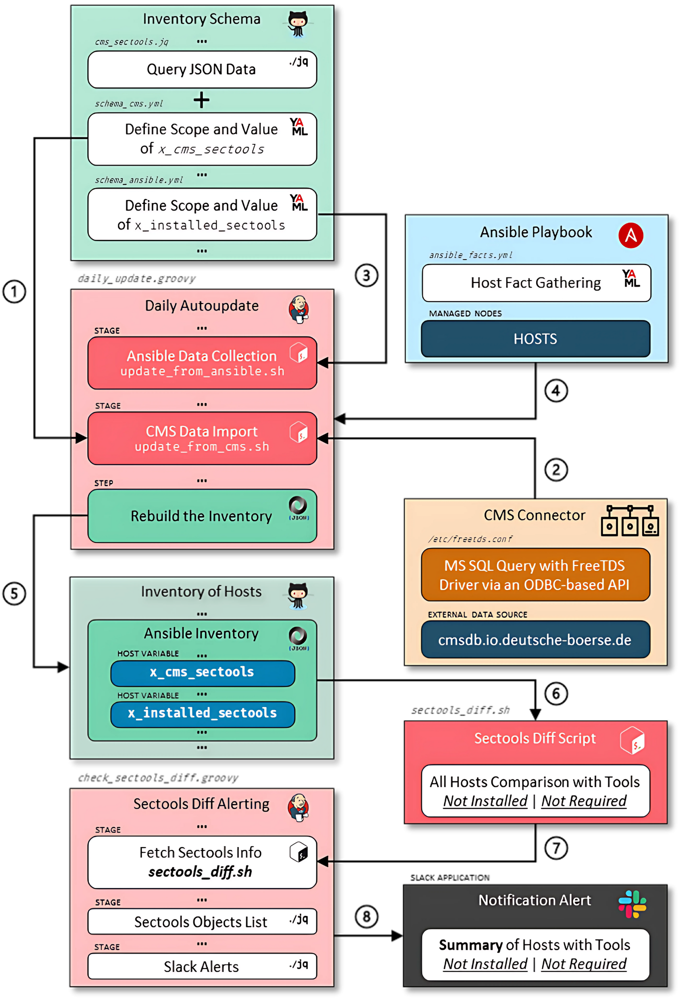

### **Automating Security Compliance Management with Infrastructure-as-Code**
#### Project Overview
This project automates security tool compliance management using Infrastructure-as-Code (IaC) to ensure security tools are properly onboarded across a large infrastructure (1,000+ nodes managed 24/7). Manual compliance checks are time-consuming, error-prone, and inefficient. Non-compliance can lead to significant risks, including audit issues from financial regulators.

The solution extracts attributes about each node from the **Configuration Management System (CMS)** to determine the required security tools. The actual statuses of these tools are gathered as facts using **Ansible**. Any discrepancies between the *required* and *installed* tools are flagged and reported via **Slack** notification alerts, helping users autonomously resolve issues by running playbooks to either onboard the necessary tools or remove unnecessary ones.

---

#### System Architecture & Interactions

The diagram below illustrates the system architecture before automation.

- **GitHub** serves three key functions:
  **(1)** **Hosting the infrastructure inventory**
  GitHub stores the infrastructure inventory as JSON and YAML files, with each host having a dedicated YAML file. These files are used by Ansible for automation.
  **(2)** **Storing automation code**
  GitHub holds the scripts that collect and process data from managed nodes and external sources.
  **(3)** **Exposing data via HTTPS**
  Maintained data is exposed via HTTPS for use in web applications and reports, with host details available through the dedicated YAML files.

- **Jenkins** automates job execution by pulling code and data from GitHub, running tasks, and pushing updated inventory data back to GitHub. It also triggers Slack notifications to alert internal users about relevant automation events, providing actionable insights.

- **Ansible** is used within Jenkins pipelines to execute playbooks on managed nodes, collecting real-time data and ensuring accurate inventory updates.

---

#### Inventory of Hosts

The infrastructure inventory is maintained in three formats to support both automation and user access:

1. **Web Application View** – Provides a structured interface for reviewing and managing host details. *(See left image below)*

2. **YAML for Each Host** – Each host has a dedicated YAML file, making it easy to manage specific configuration details and status. *(See right image below)*

3. **JSON for Ansible** – Used in automation workflows but not visually represented here.

**Note**: Certain details (e.g., hostnames, IP addresses) have been intentionally obscured for confidentiality reasons.

    
    

---

#### Proposed Solution & Data Flow
The model below outlines the proposed solution to:

- Identifies **required** security tools for each host
- Retrieves **onboarded** security tools for each host
- **Alert** users about non-compliant hosts, listing missing or unnecessary security tools across all managed nodes

It illustrates how different tools (CMS, Ansible, Jenkins, GitHub, Slack) and newly created code interact to automate the process. The model also highlights key components—such as the CMS Connector, Inventory Schema, Inventory of Hosts, and the Daily Auto-Update CD Pipeline—showing how data flows between them. Additionally, it maps out how scripts and code updates are used to retrieve, process, and validate security tool compliance across all managed hosts.

The numbered steps help explain how the data flows and how each part connects to the overall goal.

1. The `update_from_cms.sh` script extracts the `x_cms_sectools` key from the CMS schema and creates a *CMS-scoped* `jq` filter to determine the **required** security tools for each host. The value of `x_cms_sectools` is derived from `cms_sectools.jq`, which defines the logic for identifying the expected security tools.

2. The script fetches CMS data via the `cms` connector, linking the MS-SQL database to the JSON inventory. It retrieves data using a predefined SQL query, converts it to JSON, and compares it against the current inventory. If updates are found, it applies changes to the host YAML files using the `jq` filter from step 1.

3. The `update_from_ansible.sh` script reads the Ansible schema and creates an *Ansible-scoped* `jq` filter to define the `x_installed_sectools` key, which will store the **onboarded** security tools for each host.

4. The script then runs the `ansible_facts.yml` playbook on all hosts to determine the **onboarded** security tools, store them as facts, and update the `x_installed_sectools` key in the host YAML files.

5. Once all `update_from_xxx.sh` scripts complete, the updated hosts inventory is rebuilt, committed, and pushed to GitHub.

6. The `sectools_diff.sh` script compares the `x_cms_sectools` (CMS) and `x_installed_sectools` (Ansible) lists to identify non-compliant hosts. It outputs a JSON list of hosts with security tools that are **not installed** or **not required**, which is then processed in step 7 to generate a readable table.

7. The `check_sectools_diff.groovy` Jenkins job processes the JSON output from `sectools_diff.sh`, formats it into a readable table, and prepares a Slack notification.

8.  If discrepancies are found, a Slack notification is sent with a compliance summary and a link to the Jenkins console log for details.