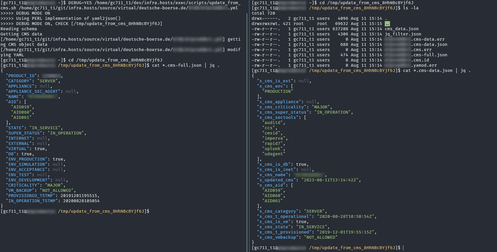
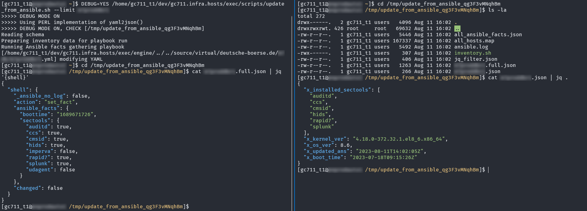
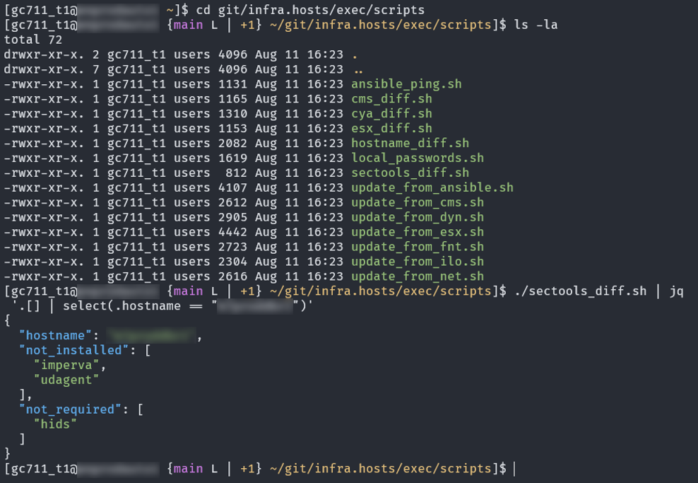

### Overview

#### `original_code/`
This folder contains the core automation components developed from scratch for managing security compliance tools.

##### Key Components
   - **`schema_cms.yml`**: Defines the structure for data obtained from CMS and links to `cms_sectools.jq`, which determines the **required** security tools based on host metadata in CMS.
   - **`cms_sectools.jq`**: Implements the logic to determine the **required** security tools for each host based on its metadata (e.g., roles, attributes) within CMS.
   - **`schema_ansible.yml`**: Specifies the Ansible schema that stores **onboarded** security tool information.
   - **`ansible_facts.yml`**: Ansible playbook used to gather host facts and update the **onboarded** security tools.
   - **`sectools_diff.sh`**: Compares the CMS and Ansible security tool lists to identify non-compliant hosts and outputs a JSON list of discrepancies.
   - **`check_sectools_diff.groovy`**: Groovy script that processes the JSON output from `sectools_diff.sh`, formats the results into a readable table, and sends a Slack notification to alert users about non-compliant hosts.

Although the core automation components are included in the `original_code/` directory, the **`update_from_cms.sh`** and **`update_from_ansible.sh`** scripts are integral to the automation process for retrieving and processing data from CMS and Ansible. These scripts are designed to be run separately in **DEBUG mode** to validate the results obtained from CMS and Ansible, ensuring they are correct and properly formatted. The output generated in **DEBUG mode** is shown below, which helps verify the accuracy of the **required** and **onboarded** security tools for each host.

#### `sectools_example/`
This folder contains refactored example code for managing security tools on operating systems using Ansible. While the installation playbooks in this example focus specifically on **Imperva**, the `removal.yml` and `os_fullsetup.yml` playbooks are designed to handle all security tools. The refactoring improves efficiency, readability, and maintainability across the automation process.

##### Key Components
- **`README.md`**: Provides an overview and detailed instructions on installing, removing, and managing security tools.
- **`playbooks/`**: Contains playbooks for setting up and removing security tools on VMs.
  - **`os_fullsetup.yml`**: Full setup playbook for installing all required security tools.
  - **`os_sectools/imperva.yml`**: Playbook for managing the **Imperva** security tool.
  - **`os_sectools/removal.yml`**: Playbook for removing security tools from the VM.
- **`roles/`**: Defines roles related to security tools management.
  - **`os_sectools/imperva/`**: Contains tasks and default configurations for managing the **Imperva** security tool.
- **`vars/external_vars.yml`**: Stores external variables used across the playbooks for flexible configuration (e.g. HashiCorp Vault token & address).

---

### Script Outputs
#### `update_from_xxx.sh` in DEBUG mode
When running the `update_from_cms.sh` and `update_from_ansible.sh` scripts in **DEBUG mode**, temporary folders with JSON data are generated. This data helps visualize the information obtained from CMS and Ansible for the specific host.

##### `update_from_cms.sh` **Output**
Displays JSON data obtained from CMS for single host. *(Note: This output has been redacted for security reasons.)*
  

##### `update_from_ansible.sh` **Output**
Shows JSON data obtained from Ansible for single host. *(Note: This output has been redacted for security reasons.)*
  

##### `sectools_diff.sh` **Output**
Compares security tool data from CMS and Ansible, identifying tools that are either not properly onboarded (marked as **not installed**) or **not required**. *(Note: This output has been redacted for security reasons.)*
  {width=50%}