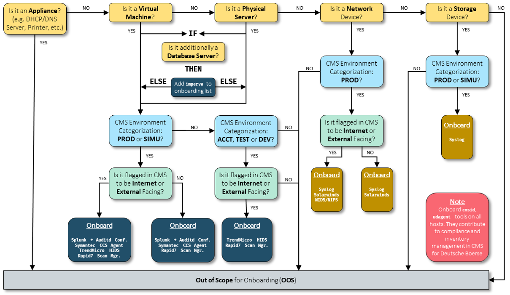
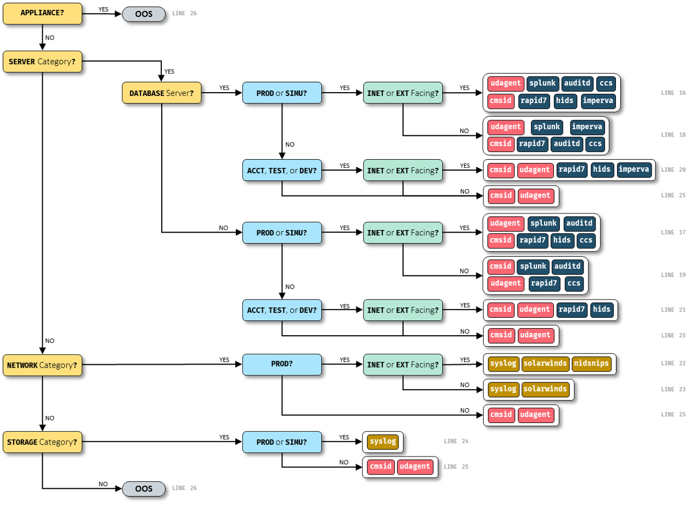

### Overview

A list of all code implemented by me is shown in `original_code/` to achieve the following goals:

1. Obtain **required** tools for each host
2. Obtain **onboarded** tools for each host
3. **Alert** users about non-compliant hosts, listing missing or unnecessary security tools across all managed nodes

The logic for the **required** security tools is derived from a process flow diagram that defines security tool onboarding requirements. This diagram is then optimized for code and translated into multiple conditions in `cms_sectools.jq`. See the corresponding diagrams below for further context.

---

### Process Flow Diagrams
#### Original Process Flow Diagram
Defines security tool onboarding requirements.

#### Optimized Process Flow Diagram
Used for code translation.

---

### Code Files

- **`schema_cms.yml`**: Defines the structure for data obtained from CMS and links to `cms_sectools.jq`, which determines the **required** security tools based on host metadata in CMS.
- **`cms_sectools.jq`**: Implements the logic to determine the **required** security tools for each host based on its metadata (e.g., roles, attributes) within CMS.
- **`schema_ansible.yml`**: Specifies the Ansible schema that stores **onboarded** security tool information.
- **`ansible_facts.yml`**: Ansible playbook used to gather host facts and update the **onboarded** security tools.
- **`sectools_diff.sh`**: Compares the CMS and Ansible security tool lists to identify non-compliant hosts and outputs a JSON list of discrepancies.
- **`check_sectools_diff.groovy`**: Groovy script that processes the JSON output from `sectools_diff.sh`, formats the results into a readable table, and sends a Slack notification to alert users about non-compliant hosts.